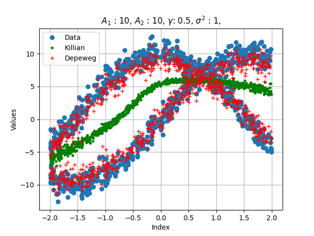

Bayesian Neural Network (BNN) Implementations: Killian et al. vs. Depeweg et al.

# Killian et al. (https://arxiv.org/pdf/1706.06544):

* This approach models the input layer with deterministic latent variables, meaning that the latent variables are fixed for a given input and are not subject to random variation.
* Alpha-divergence minimization is employed to approximate the posterior distribution over the neural network’s weights, allowing for uncertainty quantification in the model's predictions.

* The deterministic input layer helps the BNN learn complex deterministic functions but doesn't directly account for any unobserved stochastic factors in the target function.

# Depeweg et al. (https://arxiv.org/pdf/1605.07127):

* In contrast, Depeweg et al.'s BNN introduces a single stochastic variable in the input layer, specifically to capture unobserved stochastic features of the unknown target function.
* This stochastic input layer allows the model to learn both deterministic and stochastic aspects of the target function, improving its capacity to model uncertainty in situations where the underlying data generation process includes randomness that is not explicitly observed.
* The stochastic variable is integrated with the BNN using alpha-divergence minimization, similarly approximating the posterior predictive distribution over the model parameters, but with added flexibility due to the inclusion of stochastic inputs.

The key distinction between the two implementations is how they handle latent variables and stochastic input: Killian’s approach uses deterministic latent variables, while Depeweg’s introduces stochastic input to better capture hidden randomness in the data generation process. Both approaches leverage alpha-divergence minimization for learning the target function, but the inclusion of stochastic input in Depeweg's model makes it more suitable for scenarios where stochasticity plays a role in the data.

Killian et al.'s approach focuses on transferring knowledge between different environments by using deterministic latent variables within the BNN. This setup enables the model to generalize across varying conditions without needing to explicitly account for stochastic variations in the data, making it suitable for tasks where the environments share common underlying structures. In contrast, Depeweg et al. aim to increase the expressiveness of the BNN by introducing a stochastic variable at the input layer. This addition enhances the model’s ability to capture unobserved stochastic features of the target function, thereby improving its capacity to represent both deterministic and stochastic components of the data generation process.

The objective of the repository is to compare two approaches and showcase differences on a simple one dimensional data bi-model prediction problem given in https://arxiv.org/pdf/1605.07127.

### Inference Performance

The figure below illustrates the data generated by a stochastic target function, highlighting the inherent randomness in the underlying data generation process. The generated samples, which are drawn from a BNN using Depeweg et al.'s approach, capture both the deterministic trends and stochastic variations present in the target function. By incorporating stochastic input variables in the input layer, the BNN is able to accurately model the uncertainty and variability of the data, producing samples that reflect the full range of possible outcomes rather than just a fixed deterministic prediction. This enhanced expressiveness allows the model to generate a diverse set of plausible functions that align well with the observed stochastic behavior of the target function. The comparison of these two approaches are explained in detail in https://ieeexplore.ieee.org/abstract/document/10620829/ . 

### Content

* **Depeweg_BNN.py** contains a class that performs the computation for minimizing the alpha-divergence, utilizing PyTorch for ease of use compared to the original repository (https://github.com/siemens/policy_search_bb-alpha).

* **Killian_BNN.py** is adapted from the repo (https://github.com/dtak/hip-mdp-public) and solves the issue with one dimensional data.

* **Environment.py** is a file that creates data samples from the stochastic functions in the form $f(x) = B (A_1 cos(x) + n_1) + (1-B) (A_2 sin(x) + n_2)$ where $B \sim Bern(\theta)$ and $n_1, n_2 \sim \mathcal{N}(0,\sigma)$. The parameters can be adjusted within the file.
 

### Prerequisites

* PyTorch
* Numpy
* Matplotlib
* autograd
* scipy

